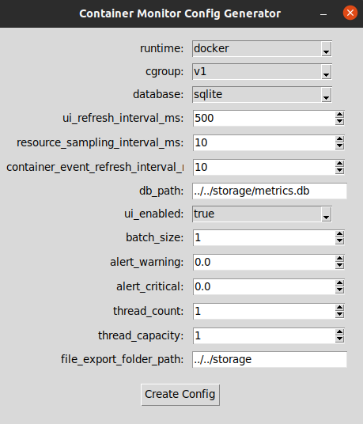
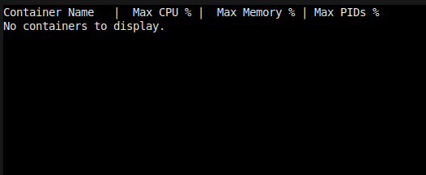
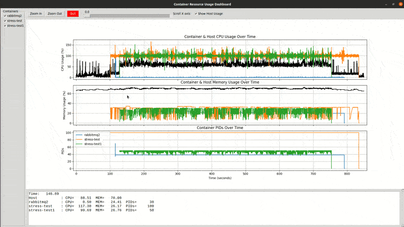

# Container Monitor for Automotive Systems

## Overview

This project is a highly configurable, real-time container resource monitoring solution specifically designed for the emerging domain of **Software Defined Vehicles (SDV)** and embedded environments. As the automotive industry transitions toward SDV architectures, containers are becoming an integral part of in-vehicle software deployment. This tool enables precise control over how container metrics are collected, visualized, and exported, making it ideal for diagnostics, validation, and post-analysis in SDV and embedded use cases where timing, reliability, and low system overhead are critical.

## Features

- **Automotive & SDV Focus:**  
  - Designed for in-vehicle, embedded, and test-bench environments.
  - Real-time monitoring of containerized workloads on ECUs and gateways.
- **Fine-Grained Control:**  
  - Tune sampling rates, batch sizes, thread counts, and alert thresholds via config.
- **Diagnostics & Post-Analysis:**  
  - Live dashboard for operators and engineers.
  - Export metrics to CSV or database for traceability and compliance.
- **Operator & Developer Friendly:**  
  - Ncurses-based UI with color-coded alerts and dynamic alignment.
  - Tkinter GUI for safe, validated configuration file generation.
- **Resource Management:**  
  - Thread pool and batch processing for efficient metric collection.
- **Extensible & Maintainable:**  
  - Modular C++ codebase, Doxygen documentation, and easy integration with new metrics or storage backends.
- **Centralized Configuration:**  
  - All runtime parameters in a single `parameter.conf` file.

## Folder Structure

```
App/
├── analysis/           # Analysis logic for live metrics aggregation
├── build/              # Build artifacts (CMake, binaries, etc.)
├── container_runtime/  # Container runtime path factories and configuration
├── database/           # Database interface and SQLite implementation
├── metrics_analyzer/   # Metrics reading and analysis logic
├── monitoring_service/ # Event listeners, processors, resource monitoring, thread pool
├── thirdparty/         # External dependencies (if any)
├── ui/                 # Ncurses dashboard and UI logic
├── utils/              # Common utilities (config parsing, logging, common types)
└── main.cpp            # Application entry point

config/
├── create_config_gui.py   # Tkinter GUI for safe config generation
└── parameter.conf         # Centralized configuration file

storage/
├── container_metrics.csv  # Exported container metrics
├── host_usage.csv         # Exported host metrics
└── metrics.db             # SQLite database (if enabled)

post_analysis/
└── plot_container_metrics.py # Scripts for plot creation for further analysis
```

## Quick Start

1. **Install Requirements**
   - Linux with cgroup v1 or v2 support
   - C++17 compiler, CMake
   - Python 3.x (for config GUI)
   - Ncurses library
   - SQLite (for database export, if enabled)

2. **Generate Configuration**
   - Run the GUI:  
     ```bash
     python3 config/create_config_gui.py
     ```
   - Fill in parameters and save to generate `parameter.conf`.

3. **Build the Project**
   - From the root directory:
     ```bash
     mkdir -p App/build
     cd App/build
     cmake ..
     make
     ```

4. **Run the Monitor**
   - From the build directory:
     ```bash
     ./container_monitor
     ```
   - The ncurses dashboard will display live container metrics.

5. **Export & Analyze**
   - Metrics are exported to CSV/database in the `storage/` folder for post-analysis.

## Configuration GUI


<!--  -->

*The above GUI (Tkinter-based) allows you to safely generate and validate your configuration file (`parameter.conf`).*

## parameter.conf Example

```ini
runtime=docker
cgroup=v1
database=sqlite
ui_refresh_interval_ms=2000
resource_sampling_interval_ms=100
container_event_refresh_interval_ms=100
db_path=../../storage/metrics.db
ui_enabled=true
batch_size=20
alert_warning=80.0
alert_critical=100.0
thread_count=3
thread_capacity=5
file_export_folder_path=../../storage
```

### Parameter Explanations

| Parameter                             | Description                                                                        |
|---------------------------------------|------------------------------------------------------------------------------------|
| `runtime`                             | Container runtime to monitor (`docker` or `podman`).                               |
| `cgroup`                              | Cgroup version used by the system (`v1` or `v2`).                                  |
| `database`                            | Database backend for historical storage (`sqlite`, `mysql`, etc.).                 |
| `ui_refresh_interval_ms`              | UI dashboard refresh interval in milliseconds.                                     |
| `resource_sampling_interval_ms`       | How often to sample container resource usage (CPU, memory, PIDs, etc) in milliseconds.  |
| `container_event_refresh_interval_ms` | How often to poll for container start/stop events in milliseconds.                 |
| `db_path`                             | Path to the database file for storing metrics.                                     |
| `ui_enabled`                          | Enable (`true`) or disable (`false`) the ncurses dashboard UI.                     |
| `batch_size`                          | Number of container samples to process by each thread.              |
| `alert_warning`                       | Warning threshold (percentage) with Yellow color in Ncurses UI for resource usage (e.g., 80.0 for 80%).            |
| `alert_critical`                      | Critical threshold (percentage) with Red color in Ncurses UI for resource usage (e.g., 100.0 for 100%).         |
| `thread_count`                        | Number of resource monitoring threads to spawn.                                    |
| `thread_capacity`                     | Maximum number of containers each thread can handle.                               |
| `file_export_folder_path`             | Directory where CSV and other export files are saved.                              |

## Ncurses-Based Real-Time Dashboard

This UI provides a clear, color-coded, and dynamically aligned view of all live containers and their max resource usage. It is designed for both engineers and operators, making it easy to monitor system health at a glance.

- **Live Updates:** The dashboard refreshes at a configurable interval, always showing the latest max metrics.
- **Color-Coded Alerts:** Resource usage is highlighted in green, yellow, or red based on configurable thresholds for quick status assessment.
- **Dynamic Alignment:** Columns automatically adjust to container name length for readability.
- **Minimal Overhead:** The UI is lightweight and suitable for embedded and automotive environments.



## Post-Analysis Dashboard & Interactive Plotting

After collecting live metrics, this project enables powerful post-analysis through CSV and database exports. The `storage/` folder contains `container_metrics.csv`, `host_usage.csv`, and (optionally) `metrics.db` (SQLite).

For in-depth analysis, use the provided Tkinter-based post-analysis dashboard (`post_analysis/plot_container_metrics.py`). This interactive tool allows you to:

- **Visualize Resource Usage:** Plot CPU, memory, and PIDs for each container and the host over time.
- **Zoom In/Out:** Focus on specific time windows using the zoom controls.
- **Scroll Timeline:** Move across the time axis to inspect different periods of activity.
- **Select Containers:** Toggle visibility of individual containers to declutter the view or focus on specific workloads.
- **Toggle Host Metrics:** Show or hide host CPU and memory usage for a clearer container-only perspective.
- **Live Data Inspection:** Hover over the plots to see precise values for all selected containers and the host at any time point.



*The above demo shows the interactive post-analysis dashboard, where you can zoom, scroll, select containers, and toggle host metrics for detailed resource usage analysis.*

## Video Walkthroughs

To help users and contributors better understand the project, two YouTube videos will be provided:

1. **Project Motivation & Background**  
   This video will explain the motivation behind building a real-time container monitor for SDV/automotive/embedded environments, the challenges addressed, and the unique features of this solution.


2. **Live Demo & Usage Guide**  
   This video will walk through the setup, configuration, real-time dashboard, and post-analysis features, demonstrating the tool in action.


*Once available, the videos will be embedded here for easy access.*

## How Is This Solution Better Than Other Tools?

- [**cAdvisor**](https://github.com/google/cadvisor):  
  Heavyweight, designed for cloud/Kubernetes, not for embedded/SDV. No real-time dashboard, limited sampling control, and not easily configurable for automotive use cases.

- [**cmonitor**](https://github.com/f18m/cmonitor/tree/master):  
  General-purpose, console-based, Python (higher overhead), limited configurability, no advanced UI, and not tailored for SDV/automotive.

- **Grafana/Prometheus:**  
  Powerful for cloud/enterprise, but requires complex setup, not real-time, and not suitable for embedded/SDV without significant adaptation.

- [**podman stats**](https://docs.podman.io/en/latest/markdown/podman-stats.1.html) / [**docker stats**](https://docs.docker.com/engine/reference/commandline/stats/):  
  Simple CLI tools, no historical export, no alerting, no dashboard, and no configurability for sampling or resource management.

## Future Work

- **Podman Support:**  
  Upcoming releases will add full support for monitoring containers managed by Podman, in addition to Docker.

- **Cgroup v2 Compatibility:**  
  The tool will be extended to support systems using cgroup v2, ensuring compatibility with the latest Linux distributions and container runtimes.

- **Expanded Metrics:**  
  Beyond CPU, memory, and PID monitoring, future versions will track additional cgroup parameters such as I/O, network usage, and block device statistics, providing a more comprehensive view of container resource consumption.

If you have specific feature requests or would like to contribute, please open an issue or submit a pull request!

## Documentation & Architecture

- For a comprehensive overview of the system design, security, and extensibility, see [Architecture Documentation](docs/architecture/architecture.md).
- Doxygen HTML docs: After building, open `docs/doxygen/html/index.html` in your browser.

## License

This project is licensed under the MIT License.