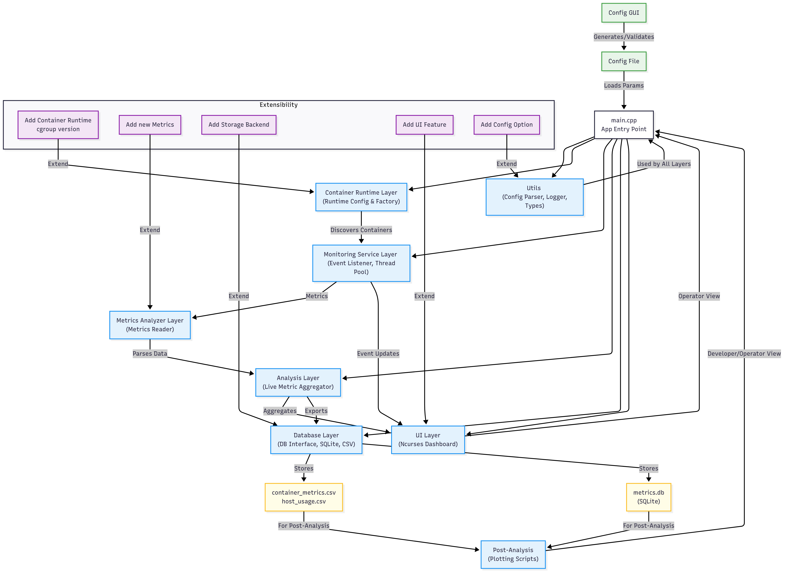
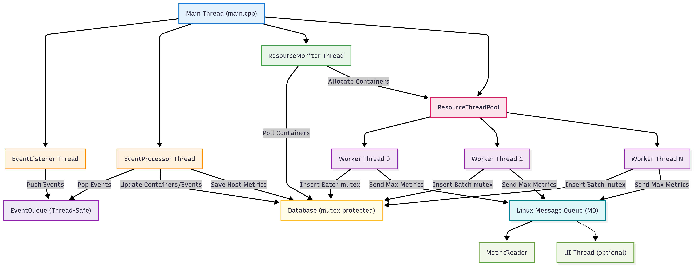
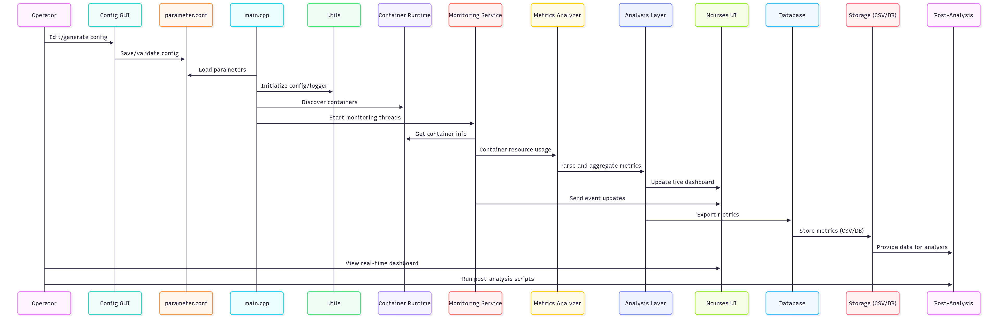
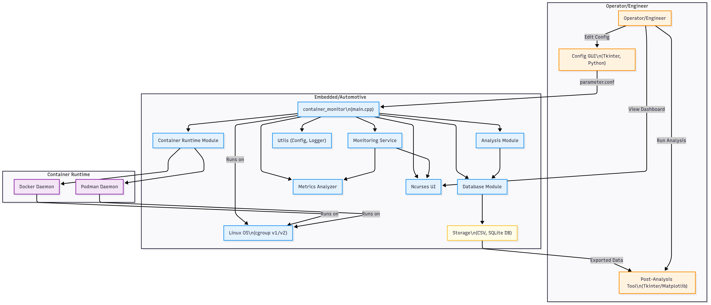

# Container Monitor Architecture

## Overview

**Container Monitor** is a modular, extensible, and real-time C++ 17 monitoring solution designed for embedded, and automotive environments. The system is architected for reliability, low overhead, and ease of integration, providing live and historical resource metrics for containerized workloads running on ECUs, gateways, and test benches.

The architecture emphasizes separation of concerns, configurability, and extensibility—enabling support for multiple container runtimes (Docker, Podman), cgroup versions, and storage backends. All runtime parameters are centralized, and the system is designed for both operator and developer usability, with a focus on diagnostics, validation, and post-analysis.

**Key architectural highlights:**

- **Modular C++ 17 Codebase:**  
  Each subsystem (analysis, runtime, database, metrics, monitoring, UI, utils) is isolated for maintainability and extensibility.
- **Centralized Configuration:**  
  All runtime parameters are managed/tuned via a single config file (`parameter.conf`), with a GUI for safe editing.
- **Real-Time & Post-Analysis:**  
  Live ncurses dashboard for operators, and CSV/DB export for in-depth post-analysis.
- **Thread Pool & Batch Processing:**  
  Efficient, scalable resource collection using a thread pool and batch sampling.
- **Extensible Storage:**  
  Supports both CSV and SQLite (with future support for more databases).
- **Operator & Developer Friendly:**  
  Tkinter GUI for config, color-coded UI, Tkinter GUI for post analysis of logs and Doxygen documentation.

**Intended Audience:**  
Developers, system integrators, and engineers seeking a robust, real-time container monitoring foundation for automotive and embedded deployments.

**Design Philosophy:**

- **Separation of Concerns:** Each module (analysis, runtime, database, monitoring, UI, utils) is isolated and replaceable.
- **Extensibility:** New runtimes, metrics, and storage backends can be added with minimal changes.
- **Operator Focus:** Real-time, color-coded UI and safe configuration workflow.
- **Production Focus:** Centralized config, robust error handling, and post-analysis support.

This document provides a deep dive into the system architecture, component responsibilities, data flow, extensibility points, and the design patterns that make Container Monitor a robust foundation for modern container monitoring needs.

## System Architecture

<!-- Placeholder for future architecture diagram -->
<!--
<div align="center">
  
</div>
-->

## Folder Structure
```
App/ 
├── analysis/           # Live metrics aggregation logic 
├── build/              # Build artifacts (CMake, binaries, etc.) 
├── container_runtime/  # Container runtime configuration and path factories 
├── database/           # Database interface and SQLite implementation 
├── metrics_analyzer/   # Metrics reading and analysis logic 
├── monitoring_service/ # Event listeners, processors, resource monitoring, threadpool 
├── thirdparty/         # External dependencies (if any) 
├── ui/                 # Ncurses dashboard and UI logic 
├── utils/              # Common utilities (config parsing, logging, types) 
└── main.cpp            # Application entry point

config/ 
├── create_config_gui.py    # Tkinter GUI for config generation 
└── parameter.conf          # Centralized configuration file

storage/ 
├── container_metrics.csv   # Exported container metrics 
├── host_usage.csv          # Exported host metrics 
└── metrics.db              # SQLite database

post_analysis/ 
└── plot_container_metrics.py # Post-analysis plotting scripts
```

## Design Patterns Used

- **Factory Pattern:**  
  Used for instantiating container runtime handlers and cgroups configuration objects.  
  _Location:_ `container_runtime/`

- **Observer Pattern:**  
  Event listeners and processors react to container events and resource updates.  
  _Location:_ `monitoring_service/`

- **Thread Pool Pattern:**  
  Efficient, concurrent resource monitoring using a thread pool.  
  _Location:_ `monitoring_service/resource_thread_pool.*`

- **Strategy/Interface Pattern:**  
  Abstract interfaces for database backends and runtime configuration.  
  _Location:_ `database/`, `container_runtime/`

- **Singleton Pattern:**  
  Centralized config parser and logger utilities.  
  _Location:_ `utils/`

These patterns ensure modularity, extensibility, and maintainability.

## Component Descriptions

### 1. Analysis Layer

- **Live Metric Aggregator:**  
  Aggregates and processes live resource metrics for containers, supporting real-time and historical analysis.

### 2. Container Runtime Layer

- **Runtime Configuration & Factory:**  
  Abstracts the details of different container runtimes (Docker, Podman), cgroup versions and path resolution.

### 3. Database Layer

- **Database Interface:**  
  Abstracts storage of historical metrics, supporting both CSV and SQLite (with future extensibility).

### 4. Metrics Analyzer Layer

- **Metrics Reader:**  
  Reads and parses resource usage data from cgroup files and runtime APIs.

### 5. Monitoring Service Layer

- **Event Listener & Processor:**  
  Listens for container lifecycle events and processes resource updates.
- **Resource Monitor & Thread Pool:**  
  Periodically samples resource usage using a thread pool for scalability.

### 6. UI Layer

- **Ncurses Dashboard:**  
  Provides a real-time, color-coded, and dynamically aligned dashboard for operators.

### 7. Utilities

- **Config Parser:**  
  Centralized configuration management, supporting both file and GUI-based editing.
- **Logger:**  
  Centralized logging for diagnostics and debugging.
- **Common Types:**  
  Shared data structures and helpers.

### 8. Post-Analysis

- **Plotting Scripts:**  
  Tkinter/matplotlib-based dashboard for interactive post-analysis of exported metrics.

## Data Flow

1. **Configuration:**  
   The system loads all runtime parameters from `parameter.conf` (optionally generated/validated via the Tkinter GUI).

2. **Container Discovery:**  
   The runtime layer discovers running containers using the configured runtime (Docker/Podman) and cgroup version.

3. **Resource Sampling:**  
   The monitoring service periodically samples resource usage (CPU, memory, PIDs, etc) for each container using a thread pool.

4. **Live Aggregation & UI:**  
   Metrics are aggregated and displayed in real-time on the ncurses dashboard, with color-coded alerts and dynamic alignment.

5. **Event Handling:**  
   Event listeners detect container start/stop events and update the monitoring set accordingly.

6. **Export & Storage:**  
   Metrics are exported to CSV and/or SQLite for traceability and post-analysis.

7. **Post-Analysis:**  
   The exported data can be visualized interactively using the provided plotting scripts.

## Extensibility

- **Add a Container Runtime:**  
  Implement a new runtime handler in `container_runtime/` and update the factory.

- **Add a Metric:**  
  Extend the metrics analyzer and aggregator to collect and process new cgroup parameters (e.g., I/O, network).

- **Add a Storage Backend:**  
  Implement a new database interface in `database/`.

- **Add a UI Feature:**  
  Extend the ncurses dashboard or post-analysis scripts for new visualizations.

- **Add a Config Option:**  
  Update the config parser and GUI to support new parameters.

## Architecture Diagram

<div align="center" style="width:90%;">
  
  
  
</div>

## Multi-Threaded Architecture

<div align="center" style="width:90%;">
  
  
  
</div>

The Container Monitor uses a robust multi-threaded architecture to achieve efficient, scalable, and real-time monitoring of container resources. The design leverages a thread pool for parallel resource collection, event-driven processing, and safe inter-thread communication using thread-safe queues and Linux message queues.

**Key components and responsibilities:**

- **Main Thread:**  
  Initializes all subsystems, starts worker threads, and manages application shutdown.

- **Event Listener Thread:**  
  Listens for container runtime events (e.g., Docker/Podman) and pushes them to a thread-safe event queue.

- **Event Processor Thread:**  
  Pops events from the event queue, updates the database with container lifecycle changes, and periodically collects host-level metrics (CPU, memory), saving them to the database.

- **Resource Monitor Thread:**  
  Periodically polls the database for the current set of containers and manages dynamic allocation/removal of containers to the resource thread pool.

- **Resource Thread Pool:**  
  Manages multiple worker threads, each responsible for monitoring a subset of containers. Each worker thread:
  - Collects resource metrics for its assigned containers.
  - Batches and inserts metrics into the database (using mutex protection).
  - Sends maximum metrics to the Linux message queue for UI consumption.

- **Linux Message Queue (MQ):**  
  Used for efficient, lock-free communication of live metrics from worker threads to the UI and metric aggregator.

- **Metric Reader:**  
  Consumes metrics from the Linux message queue for further analysis or aggregation.

- **UI Thread (optional):**  
  Reads live metrics from the message queue and displays them in a real-time ncurses dashboard.

- **Database:**  
  Central storage for all container and host metrics, protected by mutexes to ensure thread safety during concurrent writes.

**Data flow highlights:**
- Event-driven updates and host metrics collection are handled by the event processor.
- Resource monitoring is parallelized across a thread pool for scalability.
- All metrics and events are persisted in the database, while live metrics are streamed to the UI via the Linux message queue.

## Sequence Diagram

<div align="center" style="width:90%;">
  
  
  
</div>

## Deployment Diagram

<div align="center" style="width:90%;">
  
  
  
</div>

## References

- [Doxygen Documentation](../doxygen/html/index.html)
- [README.md](../../README.md)