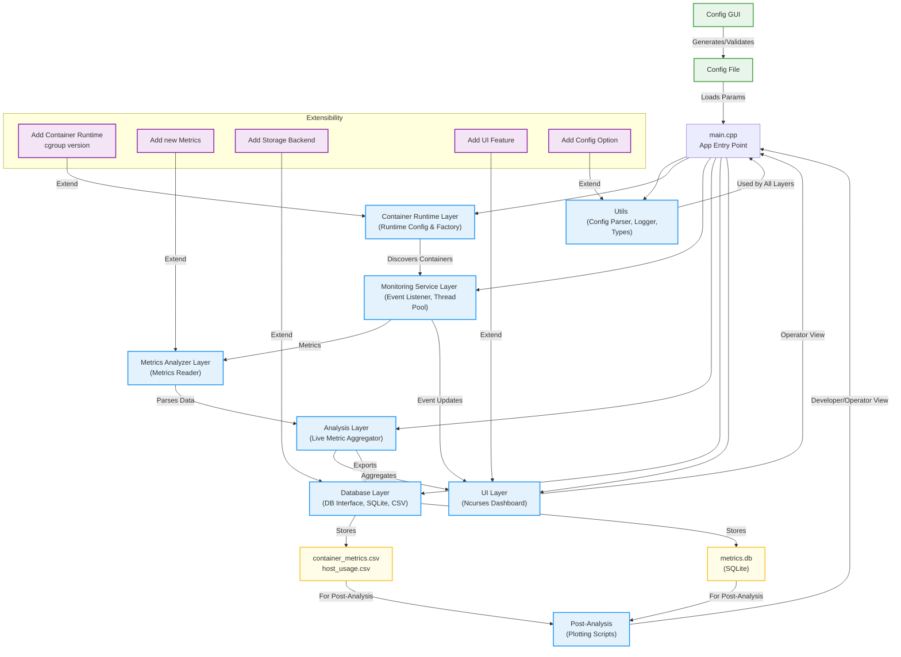
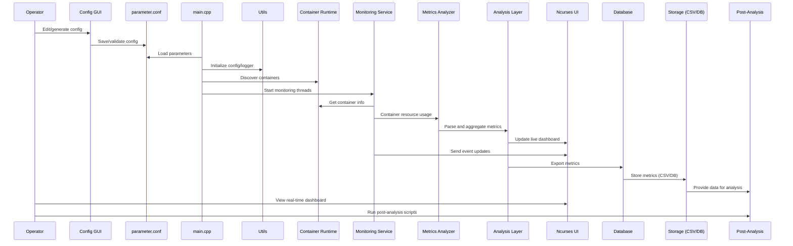
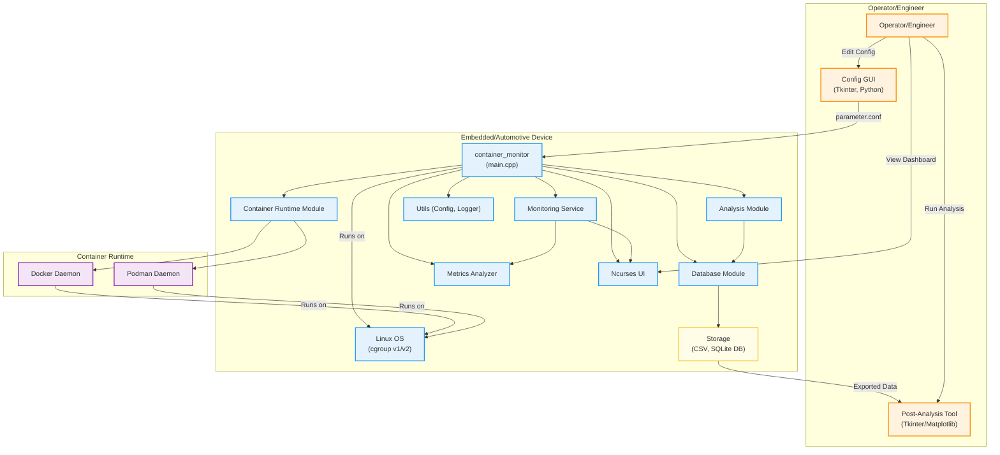

### Complete Architecture diagram

```mermaid
flowchart TD
    %% Configuration
    ConfigFile["Config File"]
    ConfigGUI["Config GUI"]

    %% Main Application Entry
    Main["main.cpp <br/> App Entry Point"]

    %% Core Layers
    Analysis["Analysis Layer <br/> (Live Metric Aggregator)"]
    Runtime["Container Runtime Layer <br/> (Runtime Config & Factory)"]
    Database["Database Layer <br/> (DB Interface, SQLite, CSV)"]
    Metrics["Metrics Analyzer Layer <br/> (Metrics Reader)"]
    Monitoring["Monitoring Service Layer <br/> (Event Listener, Thread Pool)"]
    UI["UI Layer <br/> (Ncurses Dashboard)"]
    Utils["Utils <br/> (Config Parser, Logger, Types)"]
    PostAnalysis["Post-Analysis <br/> (Plotting Scripts)"]

    %% Storage
    StorageCSV["container_metrics.csv <br/> host_usage.csv"]
    StorageDB["metrics.db <br/> (SQLite)"]

    %% Data Flow
    ConfigFile -- "Loads Params" --> Main
    ConfigGUI -- "Generates/Validates" --> ConfigFile
    Main --> Utils
    Main --> Runtime
    Main --> Monitoring
    Main --> Analysis
    Main --> Database
    Main --> UI

    Runtime -- "Discovers Containers" --> Monitoring
    Monitoring -- "Metrics" --> Metrics
    Metrics -- "Parses Data" --> Analysis
    Analysis -- "Aggregates" --> UI
    Monitoring -- "Event Updates" --> UI

    Analysis -- "Exports" --> Database
    Database -- "Stores" --> StorageCSV
    Database -- "Stores" --> StorageDB

    StorageCSV -- "For Post-Analysis" --> PostAnalysis
    StorageDB -- "For Post-Analysis" --> PostAnalysis

    UI -- "Operator View" --> Main
    PostAnalysis -- "Developer/Operator View" --> Main

    Utils -- "Used by All Layers" --> Main

    %% Extensibility
    subgraph Extensibility
        direction LR
        NewRuntime["Add Container Runtime <br/> cgroup version"]
        NewMetric["Add new Metrics"]
        NewStorage["Add Storage Backend"]
        NewUI["Add UI Feature"]
        NewConfig["Add Config Option"]
    end

    NewRuntime -- "Extend" --> Runtime
    NewMetric -- "Extend" --> Metrics
    NewStorage -- "Extend" --> Database
    NewUI -- "Extend" --> UI
    NewConfig -- "Extend" --> Utils

    %% Legends
    classDef layer fill:#e3f2fd,stroke:#2196f3,stroke-width:2px;
    classDef storage fill:#fffde7,stroke:#fbc02d,stroke-width:2px;
    classDef config fill:#e8f5e9,stroke:#43a047,stroke-width:2px;
    classDef ext fill:#f3e5f5,stroke:#8e24aa,stroke-width:2px;

    class ConfigFile,ConfigGUI config;
    class StorageCSV,StorageDB storage;
    class Analysis,Runtime,Database,Metrics,Monitoring,UI,Utils,PostAnalysis layer;
    class NewRuntime,NewMetric,NewStorage,NewUI,NewConfig ext;
```

### Sequence diagram

```mermaid
sequenceDiagram
    participant Operator
    participant ConfigGUI as Config GUI
    participant ConfigFile as parameter.conf
    participant Main as main.cpp
    participant Utils
    participant Runtime as Container Runtime
    participant Monitoring as Monitoring Service
    participant Metrics as Metrics Analyzer
    participant Analysis as Analysis Layer
    participant UI as Ncurses UI
    participant Database
    participant Storage as Storage (CSV/DB)
    participant PostAnalysis as Post-Analysis

    Operator->>ConfigGUI: Edit/generate config
    ConfigGUI->>ConfigFile: Save/validate config
    Main->>ConfigFile: Load parameters
    Main->>Utils: Initialize config/logger
    Main->>Runtime: Discover containers
    Main->>Monitoring: Start monitoring threads
    Monitoring->>Runtime: Get container info
    Monitoring->>Metrics: Container resource usage
    Metrics->>Analysis: Parse and aggregate metrics
    Analysis->>UI: Update live dashboard
    Monitoring->>UI: Send event updates
    Analysis->>Database: Export metrics
    Database->>Storage: Store metrics (CSV/DB)
    Storage->>PostAnalysis: Provide data for analysis
    Operator->>UI: View real-time dashboard
    Operator->>PostAnalysis: Run post-analysis scripts
```

### Deployment diagram

```mermaid
graph TD
    subgraph "Embedded/Automotive Device"
        OS["Linux OS\n(cgroup v1/v2)"]
        AppMain["container_monitor\n(main.cpp)"]
        Analysis["Analysis Module"]
        Runtime["Container Runtime Module"]
        Database["Database Module"]
        Metrics["Metrics Analyzer"]
        Monitoring["Monitoring Service"]
        UI["Ncurses UI"]
        Utils["Utils (Config, Logger)"]
        Storage["Storage\n(CSV, SQLite DB)"]
    end

    subgraph "Operator/Engineer"
        Operator["Operator/Engineer"]
        ConfigGUI["Config GUI\n(Tkinter, Python)"]
        PostAnalysis["Post-Analysis Tool\n(Tkinter/Matplotlib)"]
    end

    subgraph "Container Runtime"
        Docker["Docker Daemon"]
        Podman["Podman Daemon"]
    end

    %% Connections inside device
    AppMain --> Analysis
    AppMain --> Runtime
    AppMain --> Database
    AppMain --> Metrics
    AppMain --> Monitoring
    AppMain --> UI
    AppMain --> Utils
    Database --> Storage
    Analysis --> Database
    Monitoring --> Metrics
    Monitoring --> UI
    Runtime --> Docker
    Runtime --> Podman

    %% Operator/Engineer interactions
    Operator -- "Edit Config" --> ConfigGUI
    ConfigGUI -- "parameter.conf" --> AppMain
    Operator -- "View Dashboard" --> UI
    Storage -- "Exported Data" --> PostAnalysis
    Operator -- "Run Analysis" --> PostAnalysis

    %% OS context
    AppMain -- "Runs on" --> OS
    Docker -- "Runs on" --> OS
    Podman -- "Runs on" --> OS

    %% Color classes
    classDef device fill:#e3f2fd,stroke:#2196f3,stroke-width:2px;
    classDef operator fill:#fff3e0,stroke:#fb8c00,stroke-width:2px;
    classDef runtime fill:#f3e5f5,stroke:#8e24aa,stroke-width:2px;
    classDef storage fill:#fffde7,stroke:#fbc02d,stroke-width:2px;

    class OS,AppMain,Analysis,Runtime,Database,Metrics,Monitoring,UI,Utils,Storage device;
    class Operator,ConfigGUI,PostAnalysis operator;
    class Docker,Podman runtime;
    class Storage storage;
```